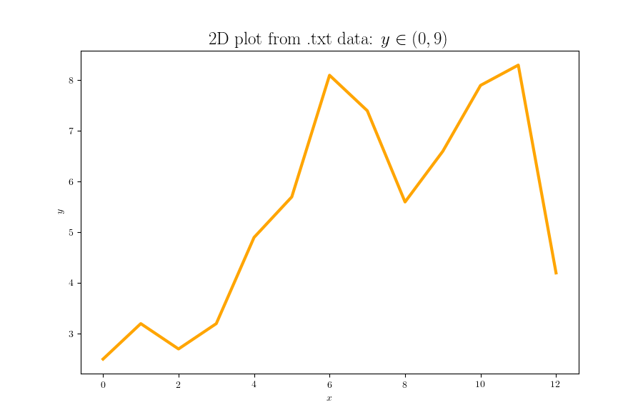

# Simple 2D plots from data file

This repos contains a simple way to add data from external files and plot it in a LaTeX-styled figure. Notice that `line.split()` here takes no arguments since each line contains 1 value, but for cases with several values per line simply add the "split"-argument. E.g. `line.split(",")` if values are separated by a comma.

